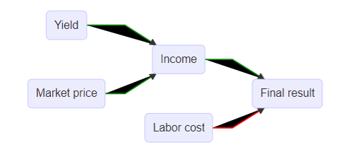
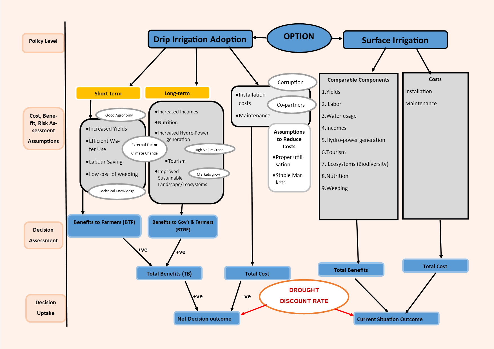
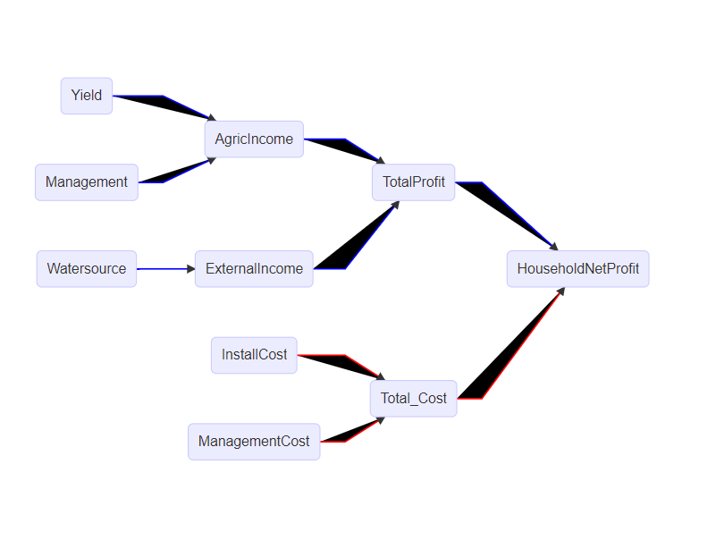
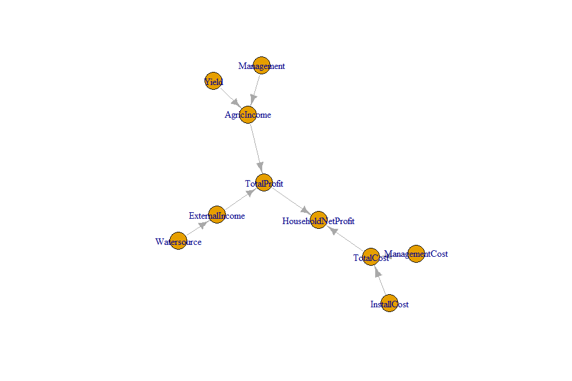
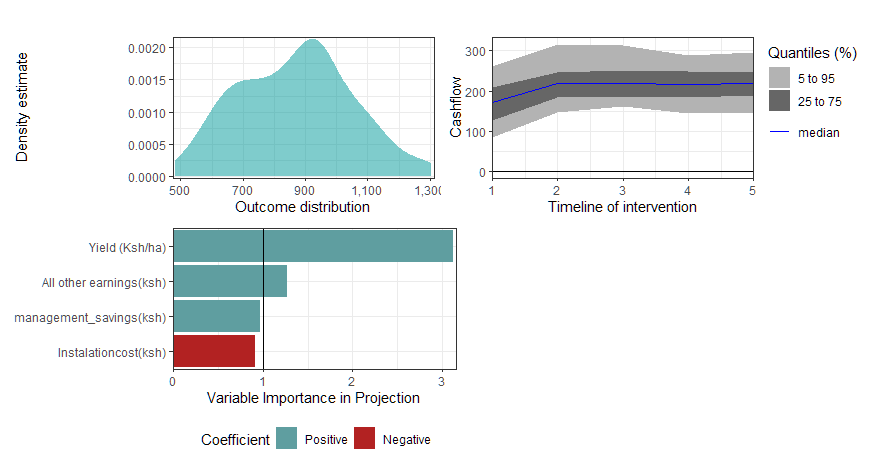

```{r setup, include=FALSE}
knitr::opts_chunk$set(echo = TRUE)
```

# Introduction

Demand for more reliable food sources, continuous depletion of the natural resources and climate change due to anthropogenic factors have become a point of concern. It is from this background that many governments around the world set up irrigation schemes to enhance food and nutrition security, improve livelihoods in rural areas. (@UNFPA2022)

Kenya has great potential to increase food production and get liberated from seasonal agriculture dependency through investing in more water efficient agricultural technologies to improve yields and subsequently rural development.(@Kanda2022)

Around 80% (Strategic-Plan-Final)of the national irrigation schemes are still under surface irrigation system like; farrow, boarder, flood methods of irrigation. This leads to wastage of water resources, depletes ground  Water, uneven distribution then has been a problem and efficient water management should be one of the solution strategies. (@NIA2019)


# Objective of the Poject. 
Efficient Water use and management.This is the core for this project. Adoption of drip irrigation as a way to reduce the amount of water use and ensure consistence agricultural production.
The authors therefore needed to know the scope and the adoption of this project across the country.
(@Mati2023)

# Method for the Analysis.
The project was fully build up from problem determination,to key stakeholders and decision makers evaluation, data generation , analysis to finial decision making outcome using Rprogramm packages.

```{r echo=FALSE, include=FALSE}
library(ggplot2)
library(ggrepel)
library(ggthemes)
library(dplyr)
library(decisionSupport)
library(imager)
library(DiagrammeR)
library(readr)
library(flextable)
library(igraph)
```


# Decision Maker
Government of Kenya is the targeted implementer of the project. All the policies we hoped to be considered are designed and and amended by the government. 

# The Project`s Stakeholders 
 The individual/group who has interests/can affect/ is affected by the decision.In the scheme there are many stakeholders and the majority was sampled to present that category.Government of Kenya, National Irrigation Authority as examples.

Based on the STRATEGIC PLAN (2019-2023) by National Irrigation Authority, 14 stakeholders were considered.
For each of them, defined : 
      -Roles
      -Major one
      -Rated : 
              -Capital availability
              -Influence
              -Expertise

These were the core basis of categorizing the stakeholders and their influence to the whole project.

In the purpose of analysis and defining most important stakeholders and the decision maker
Plot #capital availability, #expertise,  #influence.

```{r echo=FALSE}
data_stakeholder <- "https://raw.githubusercontent.com/MrOyieyo/Decision-Analysis-Project/main/Stakeholder%20Management%20data.csv"
stakeholder <- read.csv(url(data_stakeholder))

#ploting the stakeholders data
ggplot(stakeholder, aes(x = Expertise,
                                        y = Capital_Availability,
                                        label = Stakeholders,
                                        color = Influence)) +
  geom_point() +
  xlab("Adoption Influence") +
  
  
  #labeling the stakeholders names and showing in full names
  scale_x_continuous(labels = paste(seq(0, 5, by = 1)),
                     breaks = seq(0, 5, by = 1),
                     limits = c(0, 5),
                     expand = c(0, 1)) +
  
  scale_y_continuous(labels = paste(seq(0, 5, by = 1)), 
                     breaks = seq(0, 5, by = 1), 
                     limits = c(0, 5), 
                     expand = c(0, 1)) +
  
  theme(plot.margin = unit(c(1, 1, 1, 1), "cm")) +
  
  #create line to categorize stakeholders
  geom_hline(yintercept=2.5, color="yellow", linewidth=1) +
  geom_vline(xintercept=2.5, color="yellow", linewidth=1) +
  
  # Show all names of overlapped values
  geom_text_repel(box.padding = 0.3, max.overlaps = Inf, size = 3)+
  annotate("text", label = "Priority Stakeholders", 
           x = 4.5, y = 2.5, size = 5, color = "grey48") +
  annotate("text", label = "Resource persons", 
           x = 2.5, y = 4.5, size = 5, color = "grey48")

```

Government, NGO, irrigation authority = most important (as expected) 
BUT stakeholders with the strongest influence aren’t the best experts and don’t have the biggest available capital (ministry, etc.)

# Project Evaluation
Before investing into the project, precalculation  of the viability of the model needed to be determined. Project installation and setup cost against profit generation has to be evaluated.

Rain fed irrigation in Kenya follow a simple evaluation process which is rarely even undertaken by the farmers.




# Conceptual model
Framework binds to contribution effect of all the uncertainities, benefits and negatives consequences.
looking at both short term and long term benefits and general cost for the project.
Government always looks at the social economic value and the viability of the project before making decision to adopt and allocate resources.

The conceptual framework below shows the relationship between different variables and their relationship to the overral outcome of the project.

Short term effect of the project such as increased yield and production savings are at the farm basis in seasons of production. Longterm effects are the cumulative benefits that the community and the country as whole will benefit. this include such as reduction in the amount of water use which eventually leads more generation  of electricity from the waterfalls.

Apart from the benefit of the drip irrigation there is cost of the project implementation and maintenance. The different result to Present Net Value.

Surface irrigation by considering the benefit and the cost results to NPV . These will form our basic parts of Monte Carlo Evaluation process.



The general flow of the evaluation of the project model is as below.



# Impact Pathway




# Estimates
```{r, echo=FALSE, warning=FALSE}
flextable(read.csv("../Estimates.csv"))
```


## Simple model code

```{r echo=FALSE}
#### DRIP IRRIGATION ####
#Building the model
dripline_estimates <- data.frame(variable = c("Yield","Marketvalue", "Management", "Watersource", "Nutrition", "Powergeneration", "Establishmentcost", 
                                              "Managementcost"),
                                 lower = c(25, 0.5, 10, 6, 3, 5, 18, 8),
                                 median = NA,
                                 upper = c(90, 5, 39, 20, 13, 17, 81, 34),
                                 distribution = c("posnorm", "posnorm", "posnorm", "posnorm", "posnorm", "posnorm", "posnorm", "posnorm"),
                                 label = c("Yield (kg/ha)", "Price (ksh/kg)", "management_savings(ksh)", "Basinprofits(ksh)", "Nutrientgain(ksh)",
                                           "Electricity(ksh/Kw)", "instalationcost(ksh", "managementcost(Ksh)"),
                                 Description = c("Yield of the maize crop", "Market price per KG of maize grain", "Reduced cost of weed management",
                                                 "Benefits generated from efficient water use from basin", "Value of food nutrient generated", 
                                                 "Kw of electricity increased by increased water levels", "Cost of generating installing the project", 
                                                 "Cost of project maintainance" ))


dripmodel_function <- function(){
  #The model_function
  # Estimate the income in a normal season
  AgriIncome <- (Yield*Marketvalue) + Management 
  ExtIncome <- Watersource + Nutrition + Powergeneration
  TotalProfits <- AgriIncome + ExtIncome
  
  # Estimate the overall costs
  Overallcosts<- Establishmentcost + Managementcost
  
  # Estimate the final results from the model
  final_result <- TotalProfits - Overallcosts
  
  # Generate the list of outputs from the Monte Carlo simulation
  return(list(final_result = final_result))
}

# Monte-Carlo simulation
dripline_mc_simulation <- mcSimulation(estimate = as.estimate(dripline_estimates),
                                       model_function = dripmodel_function,
                                       numberOfModelRuns = 800,
                                       functionSyntax = "plainNames")

#dripline_mc_simulation

#Plot distribution
plot_distributions(mcSimulation_object = dripline_mc_simulation,
                   vars = "final_result",
                   method = "boxplot_density",
                   old_names = "final_result",
                   new_names = "Outcome distribution for profits")


#### SURFACE IRRIGATION ####
#surface irrigation pathway
SurfaceIrr_path<-graph.formula(SurfaceIrr-+Yield,
                               SurfaceIrr-+Incomes,
                               SurfaceIrr-+Management,
                               MaintenanceCost-+SurfaceIrr,
                               MaintenanceCost-+TotalCost,
                               Incomes-+TotalBenefits,
                               Management-+TotalBenefits,
                               Yields-+TotalBenefits,
                               TotalBenefits-+CurrentSituationOutcome,
                               TotalCost-+CurrentSituationOutcome)
#plot(SurfaceIrr_path)

SurfaceIrr_Path<-graph.formula()

#surface Irrigation estimates
SurfaceIrr_estimates <- data.frame(variable = c("Yield","Management","Incomes","Maintenancecost"),
                                   lower = c(14, 2, 20, 4),
                                   median = NA,
                                   upper = c(20, 10, 23, 10),
                                   distribution = c("posnorm","posnorm","posnorm","posnorm"),
                                   label = c("Yield (kg/ha)","Savings","Incomes (Ksh)","managementcost(Ksh)"),
                                   Description = c("Total Yields (Ksh","Savings from Management (Ksh)","All incomes earned (Ksh)","Cost of project maintainance"))

#SurfaceIrr_estimates

#Surface Irrigation Function
SurfaceIrr_function <- function(){
  TotalBenefits <-(Yield+Management+Incomes)
  TotalCost<-Maintenancecost
  final_result<-TotalBenefits-TotalCost
  return(list(final_result = final_result))
}

# Monte-Carlo simulation
SurfaceIrr_mc_simulation <- mcSimulation(estimate = as.estimate(SurfaceIrr_estimates),
                                       model_function = SurfaceIrr_function,
                                       numberOfModelRuns = 800,
                                       functionSyntax = "plainNames")


#Plot distribution
plot_distributions(mcSimulation_object = SurfaceIrr_mc_simulation,
                   vars = "final_result",
                   method = "boxplot_density",
                   old_names = "final_result",
                   new_names = "Outcome distribution for profits")

```
# Model Upgrade
Possibility of the outcome determined by using both scenarios under drought or under no drought influence. As an external factor out of the project control, it influences the water shade and predominantly the environment around the project´s inplimentation.
```{r echo=FALSE}
#Code with drought consideration
# Imports ####

# Estimates table
datatable <- "https://raw.githubusercontent.com/MrOyieyo/Decision-Analysis-Project/main/Estimates.csv"
input_table <- read.csv(url(datatable))
#input_table<-read.csv("Model Function/Estimates.csv")

# Model function WITH DROUGHT ####
irrigation_model_function_withDrought<-function(x){
  
  # calculate drought risks: impact the implementation of drought ####
  droughtEvent <-chance_event(Drought_Event, 1, 0, n = 5)
  
  #  Intervention ####
  for (decision_drip_irrigation in c(FALSE,TRUE)){
    
    if (decision_drip_irrigation){
      
      # Profits ####
      Profits<-vv(Drip_Yield,Var_CV,n_years)*Marketvalue+Drip_Management+Drip_All_other_incomes
      
      # Costs ####
      Drip_Establishmentcost<-c(Drip_Establishmentcost,0,0,0,0)
      Overallcosts<- Drip_Establishmentcost+Drip_MaintenanceCost
      
      # Results ####
      net_benefits <- Profits - Overallcosts
      result_drip <- net_benefits
    }
    
    else{
      
      # Profits ####
      # Drought
      Profits<-vv(Surface_Yield,Var_CV,n_years)*
          (1-vv(Drought_Discount, Var_CV,n_years)*droughtEvent)*
          Marketvalue+Surface_Management+Surface_All_other_incomes
      
      # Costs ####
      Surface_Establishmentcost<-c(Surface_Establishmentcost,0,0,0,0)
      Overallcosts<- Surface_MaintenanceCost+Surface_Establishmentcost
      
      # Results ####
      net_benefits <- Profits - Overallcosts
      result_surface <- net_benefits}
    
  }   #close intervention loop bracket
  NPV_interv <-
    discount(result_drip, discount_rate, calculate_NPV = TRUE)
  
  NPV_n_interv <-
    discount(result_surface, discount_rate, calculate_NPV = TRUE)
  
  return(list(Drip_NPV = NPV_interv,
              Surf_NPV = NPV_n_interv,
              NPV_decision_do = NPV_interv - NPV_n_interv,
              Cashflow_decision_drip = result_drip,
              Cashflow_decision_surface = result_surface))}

mcSimulation_results_withDrought <- decisionSupport::mcSimulation(
  estimate = decisionSupport::estimate_read_csv("https://raw.githubusercontent.com/MrOyieyo/Decision-Analysis-Project/main/Estimates.csv"),
  model_function = irrigation_model_function_withDrought,
  numberOfModelRuns = 200,
  functionSyntax = "plainNames"
)

# Plot distrbution ####
decisionSupport::plot_distributions(mcSimulation_object = mcSimulation_results_withDrought, 
                                    vars = c("Drip_NPV","Surf_NPV"),
                                    method = 'smooth_simple_overlay', 
                                    base_size = 7)+
  decisionSupport::plot_distributions(mcSimulation_object = mcSimulation_results_withDrought, 
                                      vars = c("Drip_NPV",
                                               "Surf_NPV"),
                                      method = 'boxplot')
# Plot cashflow ####
plot_cashflow(mcSimulation_object = mcSimulation_results_withDrought, 
              cashflow_var_name = c("Cashflow_decision_drip", "Cashflow_decision_surface"),
              x_axis_name = "Years with intervention",
              y_axis_name = "Annual cashflow in Ksh",
              color_25_75 = "purple4", color_5_95 ="purple2",
              color_median = "red", 
              facet_labels = c("Drip irrigation", "Surface irrigation"))

# Compound drip irrigation
compound_figure(model = irrigation_model_function_withDrought,
                input_table = input_table,
                decision_var_name = "Drip_NPV",
                cashflow_var_name = "Cashflow_decision_drip",
                model_runs = 1e2,
                distribution_method = 'smooth_simple_overlay',
                labels("Drip Irrigation"))

#compound surface irrigation
compound_figure(model = irrigation_model_function_withDrought, 
                  input_table = input_table, 
                  decision_var_name = "Surf_NPV",
                  cashflow_var_name = "Cashflow_decision_surface",
                  model_runs = 1e2, 
                  distribution_method = 'smooth_simple_overlay',
                  labels("Surface Irrigation"))  


```
````{r echo=FALSE}
#Code without drought consideration
# Imports ####
library(readr)
library(decisionSupport)

# Estimates table
datatable <- "https://raw.githubusercontent.com/MrOyieyo/Decision-Analysis-Project/main/Estimates.csv"
input_table <- read_csv(url(datatable))

# Model function WITHOUT DROUGHT ####
irrigation_model_function_withoutDrought<-function(x){
  
  # calculate drought risks: impact the implementation of drought ####
  droughtEvent <-chance_event(Drought_Event, 0, 0, n = 5)
  
  #  Intervention ####
  for (decision_drip_irrigation in c(FALSE,TRUE)){
    
    if (decision_drip_irrigation){
      
      # Profits ####
      Profits<-vv(Drip_Yield,Var_CV,n_years)*Marketvalue+
        Drip_Management+Drip_All_other_incomes
      
      # Costs ####
      Drip_Establishmentcost<-c(Drip_Establishmentcost,0,0,0,0)
      Overallcosts<- Drip_Establishmentcost+Drip_MaintenanceCost
      
      # Results ####
      net_benefits <- Profits - Overallcosts
      result_drip <- net_benefits
    }
    
    else{
      
      # Profits ####
      # Drought
      Profits<-vv(Surface_Yield,Var_CV,n_years)*
        (1-vv(Drought_Discount, Var_CV,n_years)*droughtEvent)*
        Marketvalue+Surface_Management+Surface_All_other_incomes
      
      # Costs ####
      Surface_Establishmentcost<-c(Surface_Establishmentcost,0,0,0,0)
      Overallcosts<- Surface_MaintenanceCost+Surface_Establishmentcost
      
      # Results ####
      net_benefits <- Profits - Overallcosts
      result_surface <- net_benefits}
    
  }   #close intervention loop bracket
  NPV_interv <-
    discount(result_drip, discount_rate, calculate_NPV = TRUE)
  
  NPV_n_interv <-
    discount(result_surface, discount_rate, calculate_NPV = TRUE)
  
  return(list(Drip_NPV = NPV_interv,
              Surf_NPV = NPV_n_interv,
              NPV_decision_do = NPV_interv - NPV_n_interv,
              Cashflow_decision_drip = result_drip,
              Cashflow_decision_surface = result_surface))}

mcSimulation_results_withoutDrought <- decisionSupport::mcSimulation(
  estimate = decisionSupport::estimate_read_csv("https://raw.githubusercontent.com/MrOyieyo/Decision-Analysis-Project/main/Estimates.csv"),
  model_function = irrigation_model_function_withoutDrought,
  numberOfModelRuns = 200,
  functionSyntax = "plainNames"
)

# Plot distrbution ####
decisionSupport::plot_distributions(mcSimulation_object = mcSimulation_results_withoutDrought, 
                                    vars = c("Drip_NPV","Surf_NPV"),
                                    method = 'smooth_simple_overlay', 
                                    base_size = 7)+
  decisionSupport::plot_distributions(mcSimulation_object = mcSimulation_results_withoutDrought, 
                                      vars = c("Drip_NPV",
                                               "Surf_NPV"),
                                      method = 'boxplot')
  # Plot cashflow ####
plot_cashflow(mcSimulation_object = mcSimulation_results_withoutDrought, 
              cashflow_var_name = c("Cashflow_decision_drip", "Cashflow_decision_surface"),
              x_axis_name = "Years with intervention",
              y_axis_name = "Annual cashflow in Ksh",
              color_25_75 = "purple4", color_5_95 ="purple2",
              color_median = "red", 
              facet_labels = c("Drip irrigation", "Surface irrigation"))


# Compound drip irrigation
compound_figure(model = irrigation_model_function_withoutDrought,
                input_table = input_table,
                decision_var_name = "Drip_NPV",
                cashflow_var_name = "Cashflow_decision_drip",
                model_runs = 1e2,
                distribution_method = 'smooth_simple_overlay',
                labels("Drip Irrigation"))

#compound surface irrigation
compound_figure(model = irrigation_model_function_withoutDrought,
                input_table = input_table,
                decision_var_name = "Surf_NPV",
                cashflow_var_name = "Cashflow_decision_surface",
                model_runs = 1e2,
                distribution_method = 'smooth_simple_overlay',
                labels("Surface Irrigation"))
````
# Analysis and Result


        


# Learning point
We hope to come up with estimate data that will give value to the uncertainties linked to our project using McSimulation. 
Building the model with Plot of the impact pathway and calibration of the data will consequentially take place.

Setseed - to set the run of codes should start.

# References
```{r add_R_bib, include=FALSE}
knitr::write_bib(c(.packages(),
                   'knitr','decisionSupport'), 'export.bib')
```


```{r echo=FALSE}

```
 

# THANK YOU
